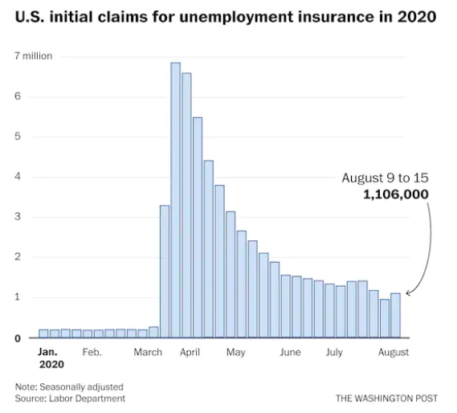
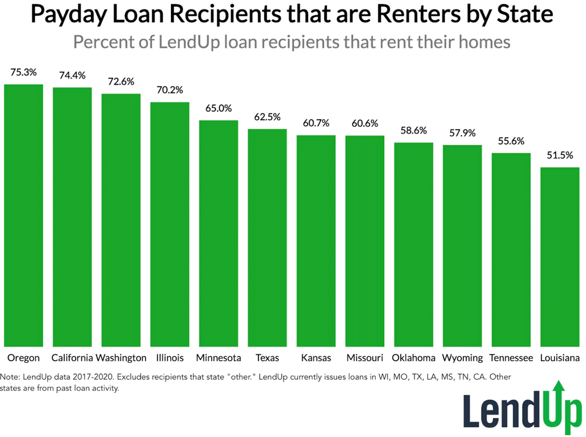

___


https://projects.fivethirtyeight.com/trump-approval-ratings/voters/

This graphic depicts a lot of data at once, but it manages to still be highly readable by using light, desaturated colors for the data points and keeping the regression lines bold and saturated. This prevents the reader from being overwhelmed by visual clutter, and would emphasize any trends in the data if it were less steady. It's also interactive--mousing over any point on the chart gives you the actual poll averages for that specific day. My only criticism is that equally saturated green and orange are poor choices for colorblind accessibility, making the two months or so where the graph is in flux harder to interpret.

___




https://www.washingtonpost.com/business/2020/08/20/august-unemployment-claims/

This bar chart presents the data such that anyone can, at a glance, identify the trends in unemployment pre- and post- March. It's also easy to visually compare the unemployment rate at different times in the dataset. One criticism I do have is that it's not obvious how all the bars fit in time. It could be helpful to group the bars by months like in a clustered bar chart, or  better yet to just add vertical gridlines corresponding to the first of each month.

___



https://priceonomics.com/the-housing-crisis-how-much-do-payday-loan/

You can easily compare states with each other from this visualization, and determine which has the greater proportion of renters. Organizing the bars in descending order helps with this, and also instantly communicates the rankings without any effort on the reader's part. However, it's difficult to judge absolute magnitudes on this graph, and the  bar sizes don't visually convey the actual ratio of renters to non-renters in each state. A y-axis, faint gridlines, or even just a line marked 100% would help significantly, but as is this graphic is arguably less useful than a ranked table.

___


https://projects.fivethirtyeight.com/covid-forecasts/?cid=rrpromo

(I didn't intend for this to assignment to be so virus/recession themed...)

The strongest feature of these visualizations is that they give you a quick sense of how the death rate has changed over time in each state, based on the slope of the graphs. They also use several published models to forecast casualties into the next month, which I thought was pretty interesting (albeit grim.) 
One concern I have with their presentation: the vertical scales are all different, and yet the layout makes it really tempting to visually compare death rates across states. So an uncritical reader might leave with the impression, for example, that Texas and Utah had suffered roughtly the same rate of deaths since July, which isn't even remotely true.

___


```r
plot(1:20)
```

<!-- -->


