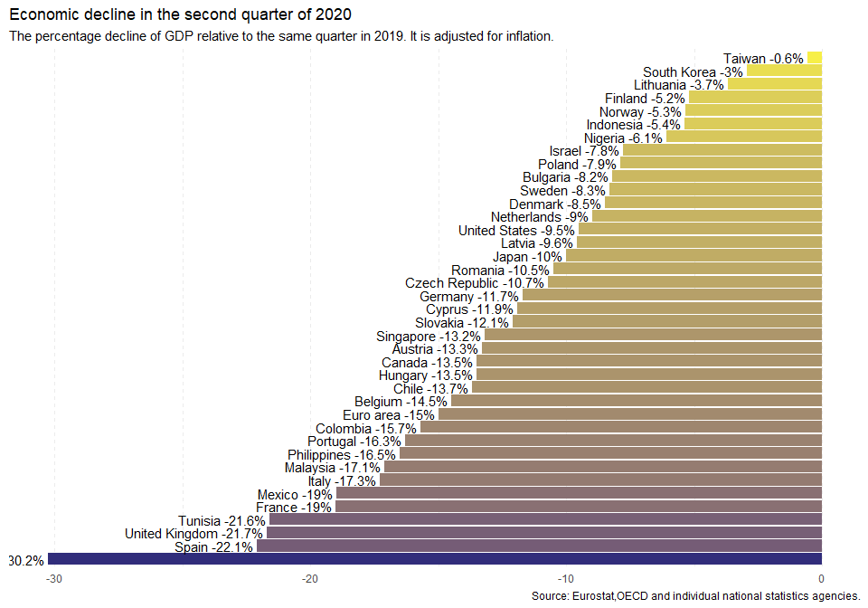
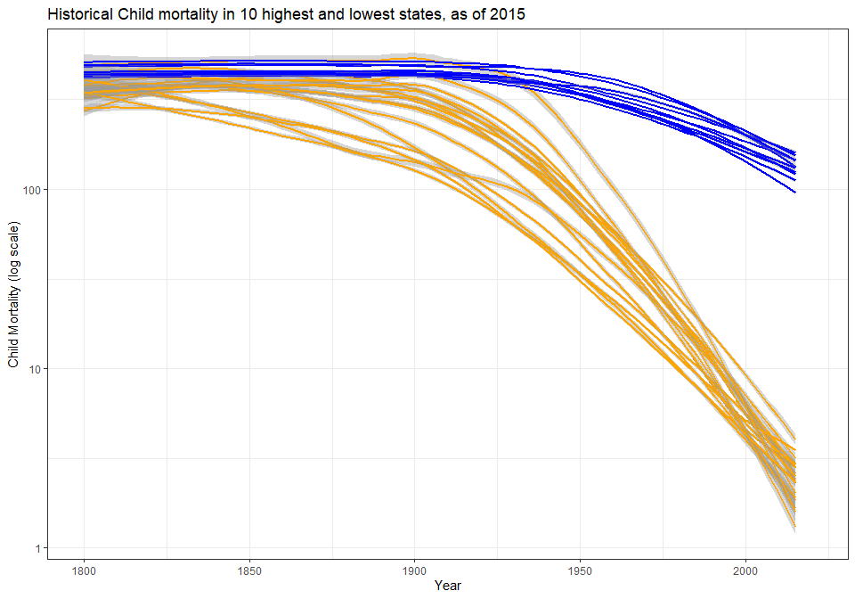

## Our World in Data Recreation

<!-- -->

This graphic is reproduced from one featured in an Our World in Data report on the effect that COVID-19 and the recession have had on different countries' economies, and how this related to the scale of their health response. The scale on the y-axis represents percentage growth of each country's economy since 2019. With the exception of China (not pictured), all nations recorded in the original dataset experienced negative growth.

[Link to Source Data](ourworldindata.org/covid-health-economy)

## Childhood Mortality Visualization

<!-- -->

This second graph captures the trends in deaths under the age of five by country, using a historical dataset that goes back to around 1800 (and earlier, in a few placess). Since there are way too many countries in the dataset to include in one plot, I elected to depict only the top (orange) and bottom (blue) 20 countries in my graphic. The idea was to maintain readability, while also emphasizing the disparity in mortality rates throughout the world. I used a smoothing function and a logarithmic scale, again to cut down on clutter and make the overall trend in each country more readable.
