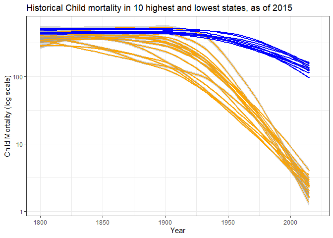

---

```r
Economy
```

<!-- -->
This graphic shows how much each country's economy has suffered in the past year. The scale on the y-axis represents percentage growth relative to each country's economy, in the last year. With the notable exception of China (not pictured), all nations with recorded data in the dataset experienced negative groowth.


source: https://ourworldindata.org/covid-health-economy
---


```r
mortality
```

```
## `geom_smooth()` using method = 'loess' and formula 'y ~ x'
```

```
## Warning: Removed 249 rows containing non-finite values (stat_smooth).
```

```
## `geom_smooth()` using method = 'loess' and formula 'y ~ x'
```

```
## Warning: Removed 1 rows containing non-finite values (stat_smooth).
```

<!-- -->
This second graph captures the trends in deaths under the age of five around the globe, using a historical dataset that goes back to around 1800 (earlier in a few countries). Since there were so many countries and not much space, I elected to depict only the top (orange) and bottom (blue) 20 countries in my graphic, to maintain readability while also showing the disparty between the poles. I also chose to use a logarithmicscale, for easier differentiation of the lines, and I used a a smoothing function to cut down on the (considerable) noise in the dataset. 
