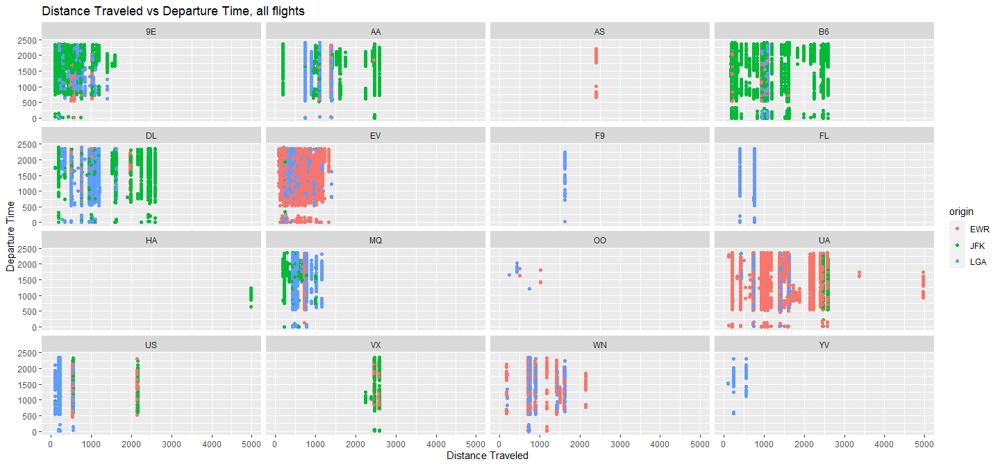
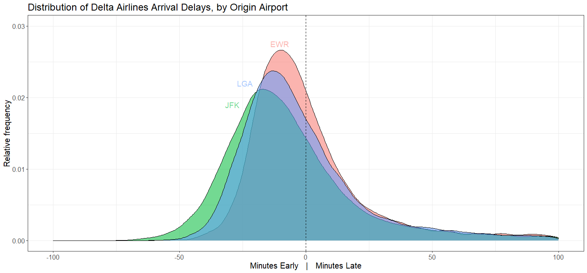
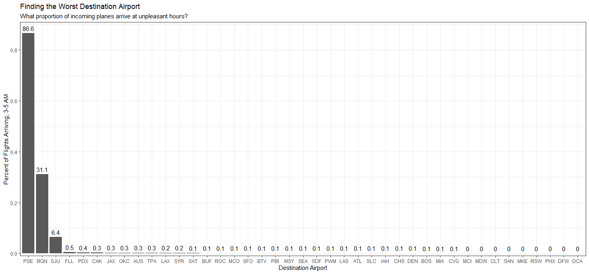

### Introduction
In this case study, I looked at a dataset containing records for all flights out of three New York Airports for 2013. To give an example the size of this dataset and the variables involved, here is a plot of departure time vs distance traveled for all recorded flights, faceted by carrier and color coded by the originating airport (it may be slow to load).


```r
ggplot(flights) + geom_point(aes(x=distance,y=dep_time,group=carrier,color=origin)) + xlab("Distance Traveled") + ylab("Departure Time") + ggtitle("Distance Traveled vs Departure Time, all flights") + facet_wrap(~carrier)
```

<!-- -->

Graphics were generated to show that JFK is the best airport to depart from in order to avoid late arrivals with Delta Airlines, and that PSE is the worst destination airport by arrival time.

### Which origin airport is best to minimize my chances of a late arrival when I am using Delta Airlines?

One simple way to answer this is to find the average arrival delay for each origin airport, and compare them. Note taht this data is for minutes late, meaning lower values are better. Flights that arrived early are entered as negative.


```r
deltaflights = flights %>% filter(carrier=="DL") 

averages = deltaflights %>% group_by(origin) %>% summarise(Mean = mean(arr_delay,na.rm=TRUE),Median = median(arr_delay,na.rm = TRUE)) %>%
  select(Origin=origin,Mean,Median) %>% arrange(Mean,Median)

kable(averages)
```


|Origin |      Mean| Median|
|:------|---------:|------:|
|JFK    | -2.379250|    -11|
|LGA    |  3.927776|     -7|
|EWR    |  8.780442|     -4|
Alternatively, you can plot the distribution of arrival delays across all outgoing flights, grouped by origin airport, and  visually assess the difference:


```
## Warning: Removed 1967 rows containing non-finite values (stat_density).
```

<!-- -->
Both methods show that JFK would be your best bet.


### Which destination airport is the worst airport for arrival time?

To determine the worst airport destination in terms of arrival time, I found the the percentage of all flights to each one which arrived at a "bad" time of day, and ranked them. The worst arrival window was defined to be between 3 and 5 AM- too late to get much sleep, if you have things to do in the morning, but also too early to go anywhere. 

<!-- -->

PSE is far and away the worst destination by this metric, with 86.6% of incoming flight falling in the unpleasant time range. BQN and SJU, the next worst, are at 31.1 and 6.4 percent respectively.
