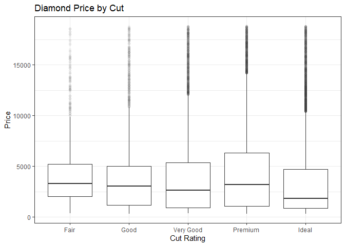

## What Drives Diamond Pricing?

As you would expect, diamond price generally goes up with diamond size, whether measuring by dimensions or carat weight.

```
## `summarise()` ungrouping output (override with `.groups` argument)
```

<!-- -->

```
## Warning: Removed 1 rows containing missing values (geom_point).
```

<!-- -->

(The volume plot is distibuted similarly to individual x, y, and z length distribituions.)


You might expect that prices should be determined to some extent by the quality of the individual diamond. Oddly enough, prices actually go down as you improve eiher the cut or quality of the diamond:

<!-- --><!-- -->


As it turns out, this apparent discrepancy is likely due to the fact that diamond weight also tends to go down with increasing quality of color and cut (relationship graphed below). **This suggests that size is the single most important determining factor in driving diamond prices.**


<!-- --><!-- -->
