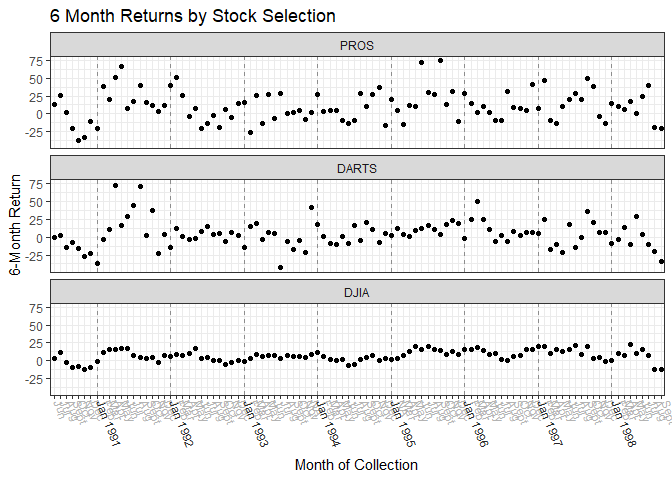

### Importing data, and formatting with Tidyr

For this task, I read in data I had tidied in a previous assignment. This is a dataset containing 3 DOW stocks, and their return from the previous six months for each month.


```r
stocks=read_rds(url("https://github.com/WJC-Data-Science/DTS350-Groharingb/raw/master/DTS350TemplateMaster/Week_07/Class_Task_13/df_tidy.rds"))
```

I then converted the month/year values into a combined factor, so that I could order the data chronologically. Also, I reordered the stocks with DJIA at the bottom, since our goal is to emphasize its contrast with the other two.


```r
stocks = stocks %>% 
  mutate(monthyear = str_c(month_end," ", year_end)) %>%            #Create a combined month-year column
  mutate(monthyear=fct_inorder(monthyear)) %>%                      #Make it an ordered factor
  arrange(monthyear) %>%                                            #Rearrange the dataset by monthyear
  mutate(variable=factor(variable,levels=c("PROS","DARTS","DJIA"))) #Ensure DJIA is the last stock
```

To reduce visual clutter, I'm using abbreviations instead of full month names. I will add years to each january label, though.


```r
stocks = stocks %>% mutate(month_abbr=
  case_when(
    month_end == "June" ~ "Jun ",
    month_end == "July" ~ "Jul ",
    month_end == "August" ~ "Aug ",
    month_end == "September" ~ "Sept ",
    month_end == "October" ~ "Oct ",
    month_end == "November" ~ "Nov ",
    month_end == "December" ~ "Dec ",
    month_end == "January" ~ str_c("Jan ","",year_end),
    month_end == "February" ~ "Feb ",
    month_end == "March" ~ "Mar ",
    month_end == "April" ~ "Apr ",
    month_end == "May" ~ "May"
  )
)
#You can't use the abbreviations directly as x-values, since they aren't all distinct like full values of monthyear.
abbr=stocks %>% arrange(monthyear) %>% filter(variable=="PROS") %>% select(month_abbr)
```

Besides the abbreviations, I created two more vectors to help with formatting the graph. These are used to grey out all the non-January month labels in the graph, and to create light lines dividing the years.


```r
axiscolors = abbr %>% mutate(
  color=case_when(
    str_detect(month_abbr,"Jan.") ~ "#262626",
    TRUE ~ "#B3B3B3"
  )
) %>% select(color)

jan = stocks %>% filter(variable=="PROS") %>%
  filter(str_detect(monthyear,"Jan|June\\s1990")) %>%
  select(monthyear)
```

### Graphing

My final graph plots, for each month, the returns on each DOW stock choice over the previous 6 months. You can see from this graph that DJIA has been the most consistent of the stocks over the measured period, though it too has fluctuated over time. 


<!-- -->

Note that I included scale_x_discrete(drop = FALSE) in the above graph. If I had levels in monthyear without associated datapoints, adding that line would also add extra ticks to my x-axis. Since I set monthyear's levels as its existing values, I don't have empty levels, and the code makes no difference.
